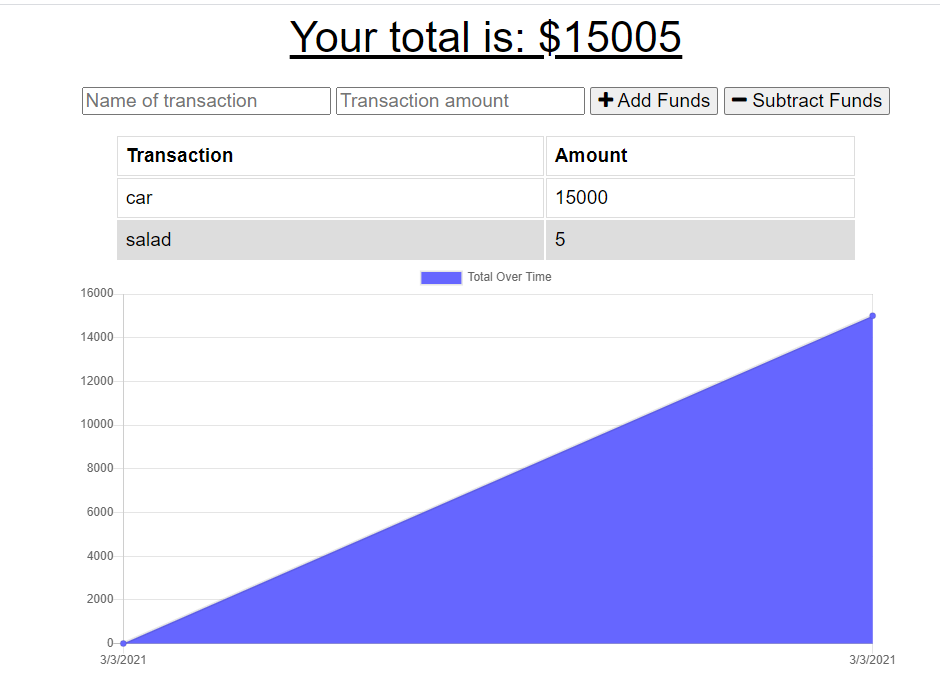

# budget-tracker

## Description

In this project we are looking to keep track of a budget both online and offline. Using web manifest and a service worker we can achieve this.

## Usage

## Installation

To install run a npm i in your terminal. Once installed, to run the application do a npm start in the terminal.

## GitHub Info

 - https://github.com/Harrichas

 ## Heroku Link

 - https://fast-journey-24272.herokuapp.com/

